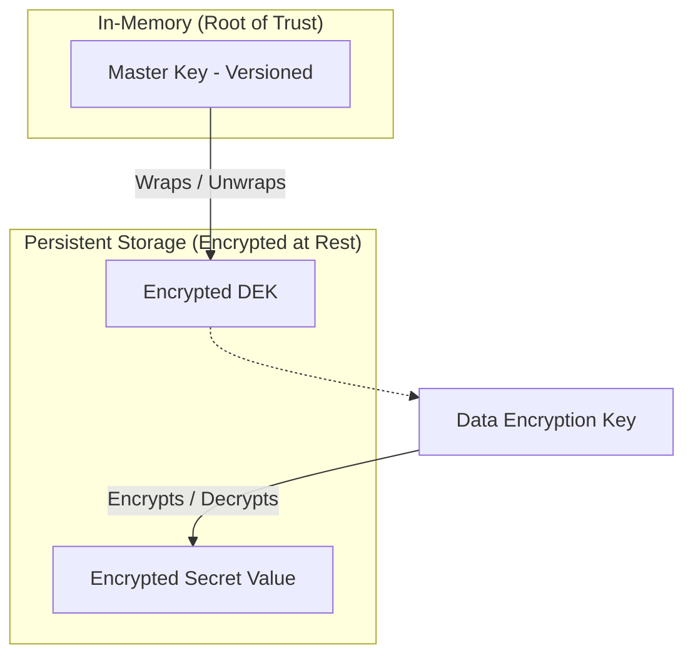
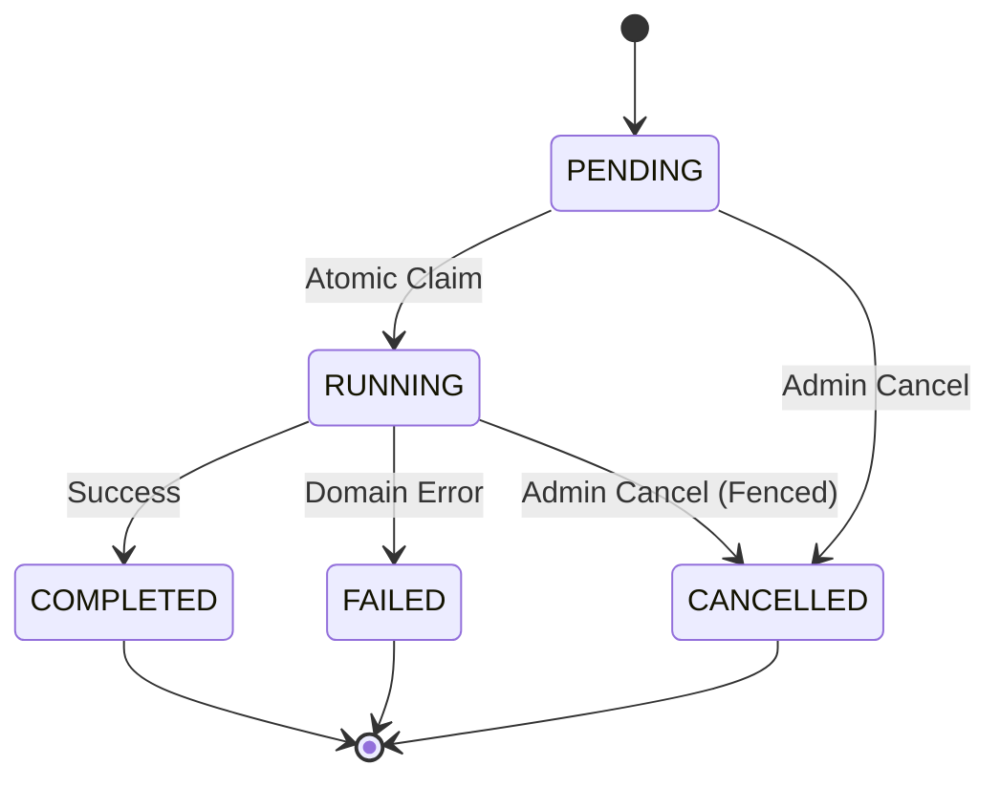

# Secrets Manager with Distributed Task Orchestration
*A security-focused backend system featuring hierarchical encryption and a resilient background task framework.*

---

## Quick Start (Docker Compose)

The system requires unique cryptographic keys to establish its **Root of Trust**. Use the provided bootstrap script to generate your local environment.

```bash
# 1. Clone the repository
git clone git@github.com:pakka-papad/secure-secrets-manager.git
cd secure-secrets-manager

# 2. Generate unique local keys (Creates a .env file)
# Requires a Bash-compatible shell (Linux, macOS, or Git Bash on Windows)
./bootstrap.sh

# 3. Start the full stack
docker compose up --build
```

The application will be available at **`http://localhost:8080`**.
*   **Swagger UI**: [http://localhost:8080/swagger-ui.html](http://localhost:8080/swagger-ui.html)
*   **Default Credentials**: `admin` / `AdminPassword123!` (generated by bootstrap)

To stop and completely remove the environment (including persistent data):
```bash
docker compose down -v
```

---

## Technical Overview

This project implements a secure secrets management platform for distributed backend environments. It focuses on three engineering problems: **safe concurrent background execution, versioned key lifecycle management, and traceability across synchronous and asynchronous boundaries.**

The system uses leaderless workers coordinated through PostgreSQL-backed task, assignment, and worker-registry tables, while keeping the cryptographic root of trust process-local and out of persistent storage.

---

## Core Architecture

### 1. Distributed Execution & Concurrency Control
Multiple nodes can poll for work concurrently without a dedicated coordinator.
*   **Atomic Claim and Reclaim**: Workers claim pending tasks through database-backed assignment records and can reclaim abandoned work when the previous worker's heartbeat becomes stale.
*   **Fenced State Updates**: Task state transitions are persisted only if the current worker still owns the assignment, preventing slow or partitioned workers from overwriting newer execution state.
*   **Failure Recovery**: Stale-worker detection and reassignment allow background operations to continue progressing after node failure.

### 2. Hierarchical Key Management (Versioning)
The system implements a versioned cryptographic model that separates the "Root of Trust" from persistent data encryption.
*   **Multi-State Key Lifecycle**: Supports `ACTIVE`, `RETIRED`, and `COMPROMISED` versions. Master keys are injected via the environment and never persisted, minimizing the attack surface.
*   **Background Re-wrapping Workflow**: Master key rotation is handled as a durable background task that re-wraps stored DEKs under the new active key without re-encrypting the underlying secret plaintext.
*   **Compromise Containment**: When a key is marked as `COMPROMISED`, its in-memory material is evicted and reads for secrets protected by that version are blocked until those secrets are replaced or migrated.

### 3. End-to-End Traceability & Forensics
Engineered to preserve traceability across the initial REST request, domain events, and background worker execution.
*   **Causal Audit Chains**: Every cryptographic action is recorded in an append-only, tamper-evident audit trail. Each entry is cryptographically linked to its predecessor using SHA-256 hashes, creating an immutable history.
*   **Cross-Boundary Correlation**: Correlation IDs are propagated across API, event, audit, security-event, and worker-thread boundaries so an operator can reconstruct the lifecycle of a request end to end.

---

## Cryptographic Design (Envelope Encryption)

The platform utilizes a multi-layered **Envelope Encryption** pattern to balance security and operational flexibility.



*   **Master Key (MK)**: A high-entropy key held strictly in memory. It is the "Root of Trust" used to protect Data Encryption Keys.
*   **Data Encryption Key (DEK)**: A unique, per-secret key generated by a CSPRNG. It is used to encrypt the actual secret payload and is stored in a "Wrapped" (encrypted) state alongside the secret.
*   **Separation of Concerns**: This model allows for rotated Master Keys (re-wrapping the DEK) without the need to re-encrypt the massive underlying datasets.

---

## Task Execution State Machine

The durable execution of background operations is governed by the following deterministic lifecycle:



---

## Performance & Scalability

The system is designed to stay fast and responsive as data volume grows.
*   **Lean Lists**: Administrative views fetch only essential metadata, ensuring that listing thousands of tasks or audit logs stays fast even if individual records contain large JSON payloads.
*   **Naturally Ordered Storage**: By using time-ordered keys for all records, the database maintains high efficiency for "Latest-First" views and sequential writes without needing extra overhead.
*   **Background Maintenance**: A built-in cleanup system automatically prunes old worker heartbeats and temporary metadata, keeping the database healthy and predictable.

---

## Administrative Control

A specialized control plane gives admins the power to monitor and manage the system's internal state.
*   **Kill-Switch Capability**: Long-running background tasks can be stopped at any time. The system uses atomic "fences" to ensure the stop is respected immediately across all nodes.
*   **Trace-Based Investigation**: Admins can use a single correlation ID to inspect the related audit records, security events, and background task activity for a transaction.
*   **Security Monitoring**: The system keeps a real-time record of failed security attempts and internal consistency violations, providing immediate forensic context for investigations.

---

## Technology Stack

*   **Core**: Spring Boot 4.x, Spring Security (RBAC), JPA / Hibernate.
*   **Crypto**: JCE (AES-GCM, AES-KW, ChaCha20-Poly1305), JWT (EC-P256).
*   **Database**: PostgreSQL 18.x with JSONB.
*   **Verification**: Dynamic E2E Grouping (isolated JVM processes per package).

---

## Future Improvements

*   **Secret Versioning**: Implementation of a versioned history model allowing for point-in-time recovery and cryptographic rollback protection.
*   **Audit Inclusion Proofs**: Transitioning from a linear audit chain to a **Merkle Tree** structure to support $O(\log N)$ cryptographic proofs of event inclusion and non-tampering.
*   **Attribute-Based Access Control (ABAC)**: A fine-grained policy engine supporting dynamic constraints such as time-of-day, IP-whitelisting, and multi-factor requirements.
*   **External KMS / HSM Integration**: Outsourcing the cryptographic "Root of Trust" to dedicated hardware or cloud-managed key services (e.g., AWS KMS, HashiCorp Vault).
*   **Secret Auto-Expiry**: Implementation of time-to-live (TTL) policies for sensitive data, utilizing the background task framework for automated secure purging of expired credentials.

